  

> **CLASSIFIED OPERATION:** DIGITAL FORENSICS & THREAT STERILIZATION  
> **STATUS:** DEPLOYED | **AUTHOR:** MR. CIPHER-X [C|THE]

 

### 🛡️ Operation Abstract

**SecureGate Pro v2.0** is an enterprise-grade Digital Forensic Kiosk designed to secure air-gapped networks against advanced persistent threats (APTs) originating from removable media. Bypassing traditional, reactive antivirus solutions, this system implements a **Kernel-Level Write Blocker** via Windows Registry modifications to strictly preserve the digital chain of custody. Suspicious files undergo deep heuristic analysis—including Shannon Entropy calculations—to detect obfuscated payloads and extension spoofing before autonomous threat sterilization.

---

### ⚙️ Forensic Microservices Architecture

```mermaid
graph TD;
    A[Unknown USB Media Inserted] -->|Intercept Storage Mount| B(Kernel-Level Write Blocker);
    B -->|Enforce Read-Only State| C{AI Heuristic Engine};
    C -->|Shannon Entropy Calculation| D[Obfuscation / Packer Detection];
    C -->|File Signature Verification| E[Extension Spoofing Detection];
    D --> F{Sterilization Protocol};
    E --> F;
    F -->|Malicious Artifacts Found| G[Secure Quarantine & Payload Neutralization];
    F -->|Benign Data| H[Authorized Access Granted];
    G --> I[Automated Chain-of-Custody Logging];
    H --> I;
    I -->|ReportLab Generation| J[Export Legally Admissible PDF Report];
    
    style A fill:#1a1a1a,stroke:#00FFFF,stroke-width:2px;
    style J fill:#1a1a1a,stroke:#8A2BE2,stroke-width:2px;
```

---

### 🦠 Forensic Threat & Mitigation Matrix

| **Threat / Vulnerability Vector** | **Forensic Detection Modality** | **System Action / Tactical Response** |
| :--- | :--- | :--- |
| **Digital Evidence Tampering** | Kernel-Level Write Blocker | Mounts media strictly as read-only; prevents OS from writing metadata, preserving court admissibility. |
| **Zero-Day & Packed Malware** | Shannon Entropy Heuristics | Flags files with high entropy (indicating encryption/packing); routes to quarantine. |
| **Extension Spoofing (e.g., .pdf.exe)** | True File Header Analysis | Cross-references magic bytes with file extensions; intercepts disguised executables. |

---

### 📸 Digital Evidence & Forensic Dashboard

*(Note: Live forensic evidence and quarantine hashes are restricted. The following displays the SecureGate Pro kiosk interface and automated report structures.)*

  
  &nbsp; &nbsp;

---

  <code>[ OPERATION TERMINATED - EVIDENCE SECURED ]</code>

